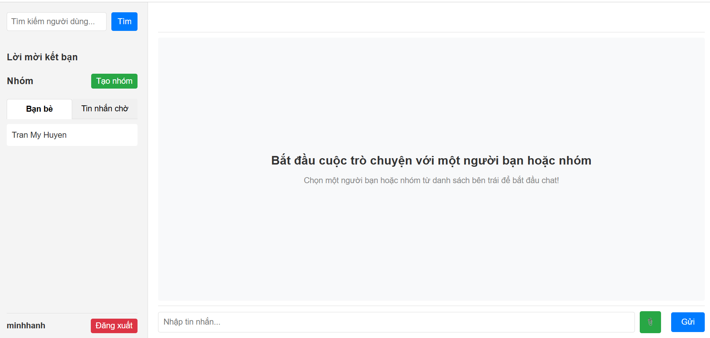
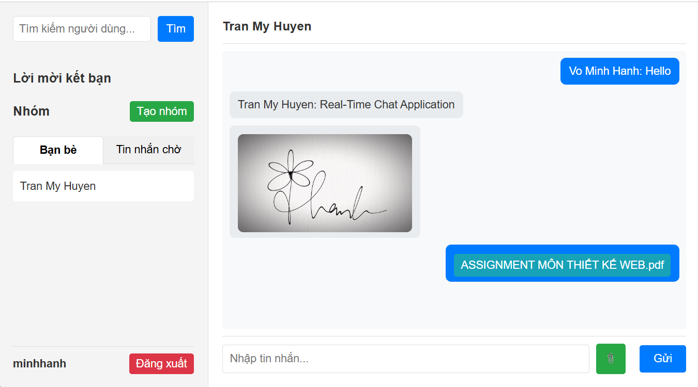
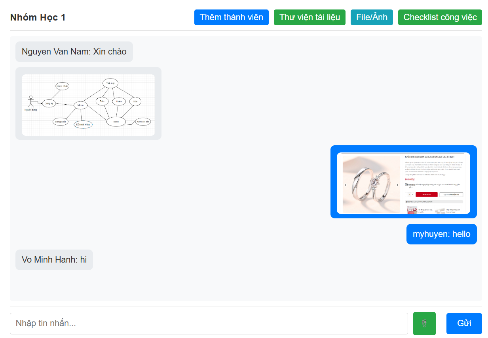
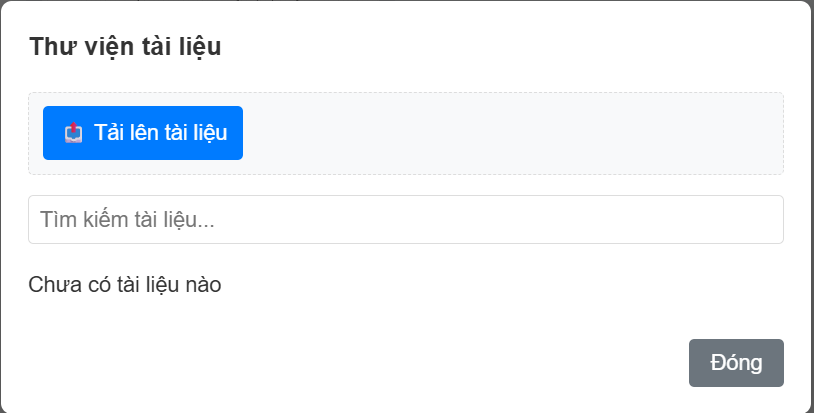
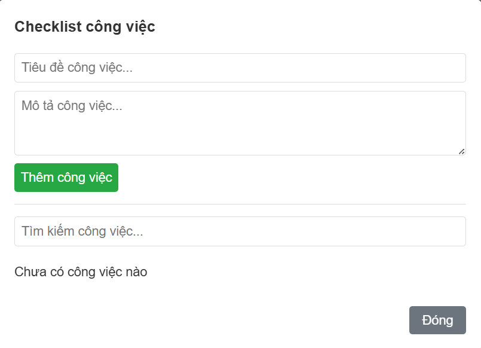
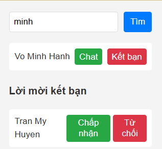
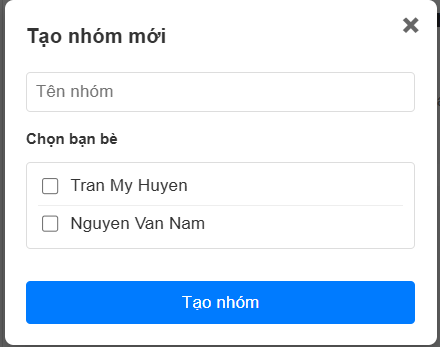

## Real-Time Chat - Ứng dụng Chat Thời gian thực

### Tác giả
- Võ Minh Hạnh
- Email: hanhminhvo1809@gmail.com

### Tổng quan
- **Mô tả**: Real-Time Chat: ứng dụng nhắn tin thời gian thực được thiết kế để hỗ trợ giao tiếp cá nhân và nhóm, tích hợp các tính năng học tập như bảng trắng cộng tác và nhắc nhở thời gian thông minh. Dự án hướng tới cung cấp trải nghiệm người dùng mượt mà, đặc biệt phù hợp cho học sinh, sinh viên và các nhóm làm việc cộng tác.
- **Tính năng**:
  - Nhắn tin cá nhân và nhóm theo thời gian thực sử dụng Socket.IO.
  - Kết bạn, tìm bạn.
  - Bảng trắng cộng tác cho phép vẽ và thảo luận trực tuyến.
  - Tự động phát hiện và thông báo nhắc nhở từ tin nhắn (ví dụ: "14:00 họp nhóm").
  - Gửi và quản lý file/ảnh trong cuộc trò chuyện.
  - Thư viện tài liệu để lưu trữ và tìm kiếm tài liệu.
  - Checklist công việc để theo dõi tiến độ nhiệm vụ.
  - Hạn chế từ ngữ nhạy cảm
- **Công nghệ**:
  - **Frontend**: HTML, CSS, JavaScript, EJS
  - **Backend**: Node.js, Express.js, Socket.IO
  - **Cơ sở dữ liệu**: MongoDB
- **Thành tựu**:
  - Xây dựng thành công ứng dụng chat thời gian thực với hiệu suất ổn định.
  - Tích hợp các công cụ học tập như bảng trắng và nhắc nhở thời gian, nhận phản hồi tích cực từ người dùng.
### Hướng dẫn cài đặt
- **Clone repository**: https://github.com/MinhHanhVo/Real-Time-Chat-Application.git
- **Cài đặt các dependencies**: npm install, nodemon, express, mongoose, socket.io,ejs
- **Cài đặt MongoDB**
- **Cấu hình file**: config/database.js
- **Chạy ứng dụng**: npm run dev

## 📸 Một số hình ảnh sản phẩm

### Trang chat:

### Chat cá nhân:

### Chat nhóm:

### Thư viện tài liệu:

### Checklist công việc:

### Tìm kiếm - Kết bạn:

### Tạo nhóm:

### Và một số tính năng khác...